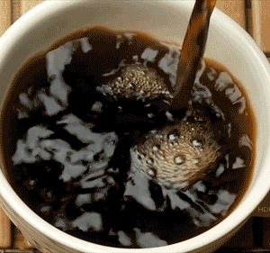
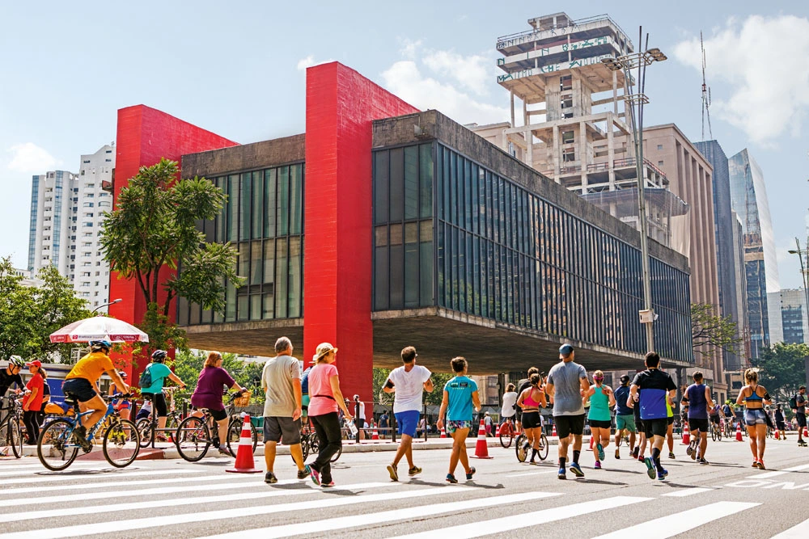

## Palavras Cafeinadas :coffee:

Este é um site desenvolvido para a Cafeteria Palavras Cafeinadas.

## Um pouco da história...

   

   
A Cafeteria Palavras Cafeinadas é uma cafeteria e livraria inaugurada por Carolina Oliveira na década de 80 em São Paulo.
Carolina era uma bibliotecária que tinha o sonho de criar um ambiente acolhedor, que
unisse uma culinária de qualidade com a sua paixão pelos livros. 

## Serviços

Apesar do foco no cafezinho da manhã e da tarde, também oferecemos
outras refeições como almoço e jantar.

## Localização

  

  
  Nós nos encontramos na Avenida Paulista, 1324 - Bela Vista - São Paulo - SP.
  
  ## Contatos
  
  :envelope: contato@gmail.com 
  :telephone: (11) 2441-2329
  
  
